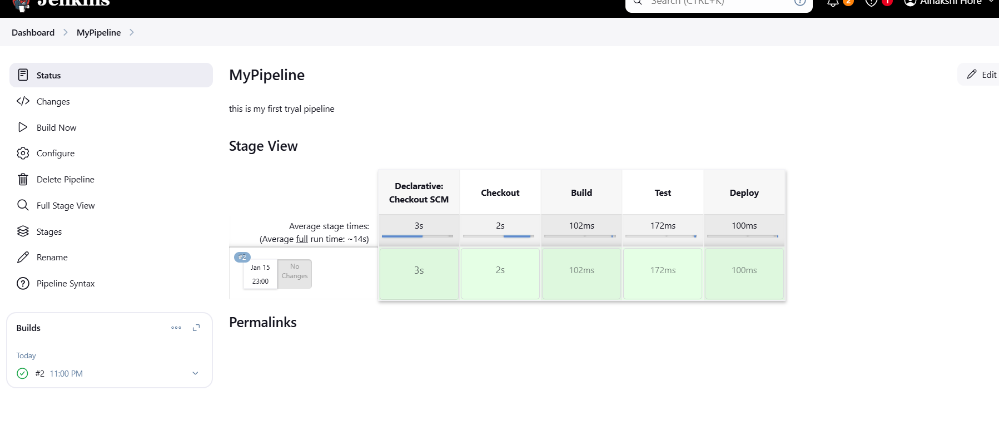

 # How Continuous Integration (CI) Improves Software Development Process

Continuous Integration (CI) is a powerful practice that enhances the efficiency and quality of software development. Here are its key benefits:

1. **Early Bug Detection**  
   - CI automatically tests code changes, catching bugs early and reducing debugging time.

2. **Improved Collaboration**  
   - Teams integrate code frequently, minimizing conflicts and enhancing teamwork.

3. **Faster Feedback**  
   - Automated pipelines provide instant feedback on code quality, enabling quick iterations.

4. **Better Code Quality**  
   - CI enforces practices like unit testing and code reviews, ensuring a stable codebase.

5. **Reduced Integration Risks**  
   - Frequent, smaller updates prevent "integration hell" and make merging easier.

6. **Confidence in Deployments**  
   - Thorough testing ensures reliable releases and supports Continuous Delivery.

7. **Enhanced Productivity**  
   - Automation saves time on repetitive tasks, allowing developers to focus on innovation.

By implementing CI, teams can streamline workflows, improve efficiency, and deliver high-quality software faster.
